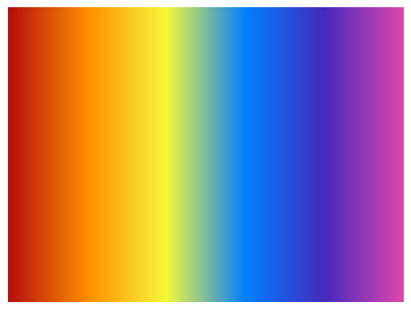
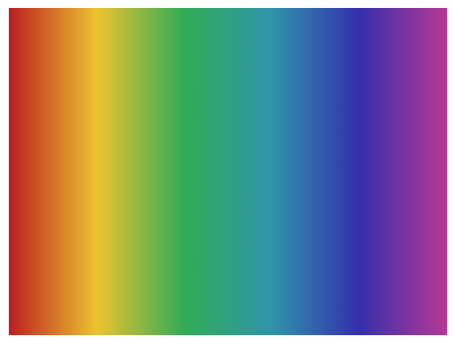
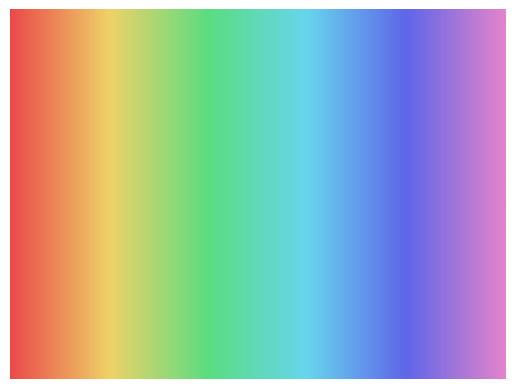
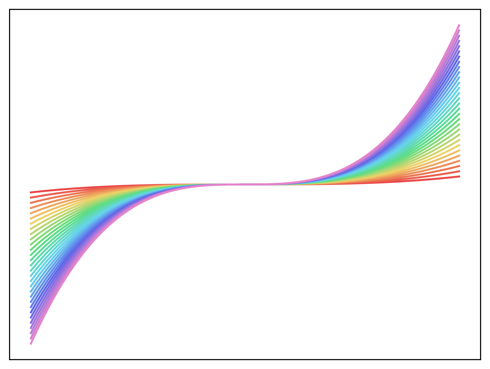

# nanoanalysis_cm
The nanoanlysis colour package for custom Matplotlib colourmaps

## Installation
pip install git+https://github.com/igtz-hub/my_colormaps.git

## How to use in file 
import my_colormaps
import matplotlib.pyplot as plt     

Then just use as you would a normal plt cm

## Colourmaps 
### Bright

### Muted

### Hazy

